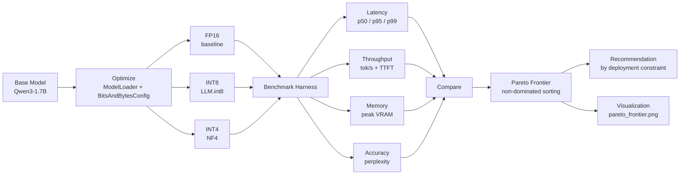

# Model Compression & Inference Optimization Platform

A benchmarking and analysis platform for evaluating LLM quantization techniques on real hardware — measuring the actual latency, memory, and accuracy tradeoffs of FP16, INT8, and INT4 quantization, and recommending the right technique for a given deployment constraint.

Built on **Qwen3-1.7B**, benchmarked on GPU, with a config-driven harness that adds new quantization techniques without touching benchmarking code.

---

## Why this exists

Most "I quantized a model" projects report a single number and stop. This platform is built around a different question: **what do you actually give up, and what do you actually gain, at each precision level — and does the answer match intuition?**

The results here don't always match intuition. INT8 (bitsandbytes LLM.int8()) turned out to be the worst-performing configuration on latency in this benchmark, despite using more bits than INT4 — a real, measured finding driven by outlier-decomposition overhead in the INT8 kernel path, not a bug. That's the kind of result a single-number benchmark hides and a proper comparison surfaces.

---

## Architecture



**Pipeline stages:**

1. **Model** — base checkpoint loaded via Hugging Face `transformers`.
2. **Optimize** — `ModelLoader` applies a quantization config (`BitsAndBytesConfig`) selected purely from a YAML file — no code changes needed to add a technique.
3. **Benchmark** — a single config-driven harness runs identical prompts across all three variants, measuring latency percentiles, throughput, TTFT, peak memory, and perplexity, with warmup runs and multiple trials per prompt.
4. **Compare** — results are consolidated into one CSV, run through non-dominated (Pareto) sorting, and turned into a plain-language recommendation plus a chart.

---

## Results (measured on this run)

| Technique | p50 Latency | Throughput | Peak Memory | Perplexity |
|---|---|---|---|---|
| **FP16** (baseline) | 4.95s | 19.9 tok/s | 3306 MB | **9.89** |
| **INT8** (LLM.int8) | 18.19s | 5.5 tok/s | 1987 MB | 10.19 |
| **INT4** (NF4) | 7.22s | 14.1 tok/s | **1313 MB** | 10.99 |

*(100 tokens/prompt, 5 prompts, 3 runs each, deterministic decoding, single NVIDIA GPU. See `configs/` for exact settings and `results/` for raw per-run data.)*

### Key finding

All three configurations land on the Pareto frontier — each wins on at least one axis nothing else matches:

- **FP16** — best latency *and* best accuracy. Wins if VRAM isn't the constraint.
- **INT4 (NF4)** — smallest memory footprint by a wide margin (60% smaller than FP16), and meaningfully faster than INT8, at a modest accuracy cost (~11% relative perplexity increase vs. FP16).
- **INT8 (LLM.int8)** — retains accuracy closer to FP16 than INT4 does, but pays for it with the worst latency of the three (3.7x slower than FP16, 2.5x slower than INT4) due to per-layer outlier decomposition overhead in the bitsandbytes INT8 kernel. **INT8 does not lead in any single deployment scenario in this benchmark** — it's Pareto-optimal in the strict sense (nothing beats it on every axis), but a practitioner choosing on any one priority (speed, memory, or accuracy) would pick FP16 or INT4 instead.

Full frontier chart: [`results/pareto_frontier.png`](results/pareto_frontier.png)
Full recommendation text: [`results/recommendations.txt`](results/recommendations.txt)

---

## Methodology

**Latency/throughput:** each config is benchmarked with 1 warmup run (discarded) + 3 timed runs per prompt, across 5 fixed prompts, with `torch.cuda.synchronize()` around every timed region to avoid measuring async kernel-launch time instead of actual execution. Decoding is deterministic (`do_sample=False`) for reproducibility. p50/p95/p99 are computed over all 15 pooled per-run latencies per config.

**TTFT** is measured as a separate single-token `generate()` call per prompt, isolated from the full 100-token generation.

**Memory** is peak CUDA allocated memory (`torch.cuda.max_memory_allocated()`), reset before each run to avoid carrying over allocation from prior runs.

**Accuracy** is measured via perplexity on a fixed 5-passage held-out text set — deliberately different from the benchmark prompts, since evaluating accuracy on the same text used for timing would conflate the two. Lower perplexity indicates the model assigns higher probability to real continuations, i.e., better language modeling quality. This is a standard, if coarse, proxy for quality retention under quantization; it does not capture task-specific degradation (e.g. reasoning, factuality) that a downstream eval suite would.

**Known limitations (stated honestly, not hidden):**
- Small sample size (5 prompts × 3 runs = 15 latency samples per config) — p99 in particular should be read as indicative, not statistically robust.
- Single hardware target — results are specific to the GPU used and will shift on different hardware, especially for the INT8 latency finding, which is sensitive to how well the GPU's kernels handle bitsandbytes' outlier-decomposition path.
- INT8/INT4 here use load-time (bitsandbytes) quantization, not a saved smaller checkpoint — model size on disk is therefore identical across configs; the memory win only shows up at runtime (`peak_memory_mb`), not in `model_size_mb`.

---

## Quickstart

```bash
# install dependencies
pip install -r requirements.txt   # transformers, accelerate, bitsandbytes, torch, pyyaml, matplotlib, numpy

# run a single benchmark
python cli.py benchmark --config configs/baseline.yaml
python cli.py benchmark --config configs/int8.yaml
python cli.py benchmark --config configs/int4.yaml

# generate comparison table, Pareto analysis, recommendation, and chart
python cli.py report --configs-dir configs
```

Each `benchmark` run reads a YAML config, applies the specified quantization (`none` / `int8` / `int4`), runs the harness, and saves results to `results/<technique>.json`. The `report` command consolidates all configs in `configs/` into `results/comparison_table.csv`, computes the Pareto frontier, writes `results/recommendations.txt`, and saves `results/pareto_frontier.png`.

### Adding a new technique

No changes to the benchmarking harness are needed. Add a new `elif` branch in `get_quantization_config()` (`src/benchmark.py`) for the new method, create a corresponding YAML config, and it flows through the existing pipeline automatically.

---

## Project structure

```
src/
  ConfigLoader.py      # YAML config loading
  ModelLoader.py        # model loading, quantization + dtype handling
  benchmark.py           # config-driven benchmarking harness (latency, memory, TTFT, perplexity)
  ParetoFrontier.py     # comparison table, non-dominated sorting, recommendation generation
  plot.py                # Pareto chart visualization
cli.py                   # single CLI entrypoint (benchmark / report)
configs/                 # one YAML per technique (baseline, int8, int4)
results/                 # per-run JSON, consolidated CSV, chart, recommendations
```

---

## Tech stack

PyTorch · Hugging Face `transformers` · `bitsandbytes` (LLM.int8(), NF4) · NumPy · Matplotlib · PyYAML

---

## Roadmap

- [ ] GPTQ / calibration-based INT4 as a second 4-bit technique, for a genuine calibration-vs-no-calibration comparison
- [ ] Structured pruning as a third compression axis
- [ ] Sensitivity-guided automated mixed-precision search (per-layer bit-width assignment, using this harness's own accuracy/latency feedback as the search signal)